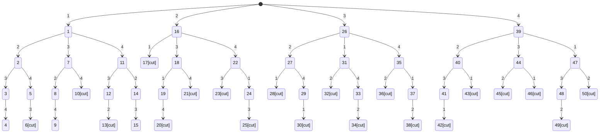

# 旅行商问题

班级：2018211303	姓名：马嘉骥	学号：2018211149

## 算法目的

某售货员要到若干城市去推销商品，已知各城市之间的路程，他要选定一条从驻地出发，经过每个城市一遍，最后回到住地的路线，使总的路程最短。

## 剪枝策略

* 如果当前正在考虑的顶点j与当前路径中的末端结点i没有边相连， 即w[i, j]= INF, 则不必搜索j所在分支。

* 如果curnCost(i) ≥ bestCost, 则停止搜索curnPath[i]分支及其下面的层 ， 其中，bestCost代表到目前为止,在前面的搜索中，从其它已经搜索过的路径中，找到的最佳完整回路的权和（总长度）

## 解空间树



## 源码

```c++
#include<iostream>

using namespace std;

const int INF = 0x7f7f7f;
int n, curnCost = 0, bestCost = INF;
int graph[4][4] = {
        {INF, 30,  6,   4},
        {30,  INF, 5,   10},
        {6,   5,   INF, 20},
        {4,   10,  20,  INF}};
int *curnPath, *bestPath;

void travel(int tier) {
    //如果达到解空间树叶子节点
    if (tier == n) {
        if (graph[curnPath[tier - 1]][curnPath[tier]] != INF && graph[curnPath[tier]][1] != INF &&
            (curnCost + graph[curnPath[tier - 1]][curnPath[tier]] + graph[curnPath[tier]][1] < bestCost ||
             bestCost == INF)) {
            for (int i = 0; i < n + 1; i++)
                bestPath[i] = curnPath[i];
            bestCost = curnCost + graph[curnPath[tier - 1]][curnPath[tier]] + graph[curnPath[tier]][1];
        }
        return;
    }
	//从当前节点向下搜索
    for (int i = tier; i < n; i++) {
        if (graph[curnPath[tier - 1]][curnPath[i]] != INF &&
            (curnCost + graph[curnPath[tier - 1]][curnPath[i]] < bestCost
             || bestCost == INF)) {
            swap(curnPath[i], curnPath[tier]);
            curnCost += graph[curnPath[tier - 1]][curnPath[tier]];
            travel(tier + 1);
            curnCost -= graph[curnPath[tier - 1]][curnPath[tier]];
            swap(curnPath[i], curnPath[tier]);
        }
    }
}

void output() {
    cout << bestCost << endl;
    cout << bestPath[1];
    for (int i = 2; i < n + 1; i++)
        cout << " " << bestPath[i];
    cout << " " << bestPath[1] << endl;
}

int main() {
    n = 4;
    curnPath = new int[n + 1];
    bestPath = new int[n + 1];

    for (int i = 0; i < n + 1; i++) {
        curnPath[i] = i;
    }

    travel(2);
    output();

    return 0;
}
```

## 运行结果

```
G:\Courseware\Algorithm\AlgorithmFinal\Task7_TSP\cmake-build-debug\TSK7.exe
25
1 2 3 4 1

Process finished with exit code 0
```

